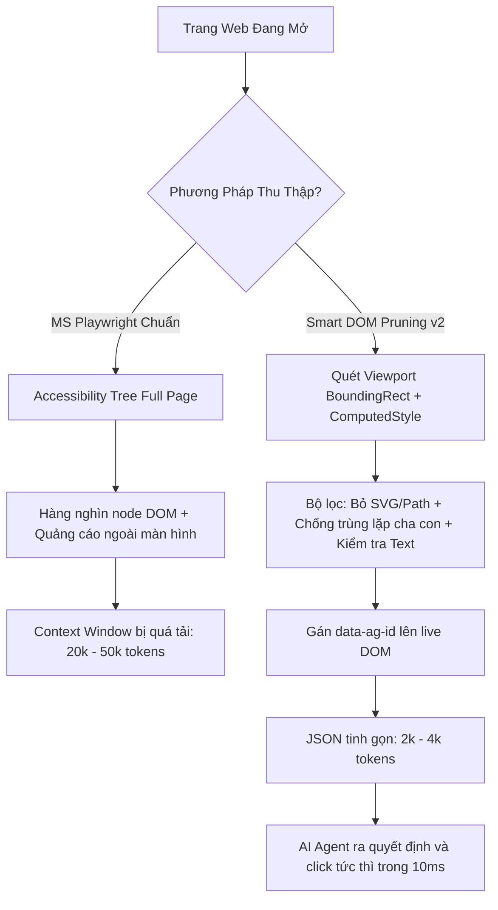

# Playwright Smart Viewport DOM Pruner (v2.0)

> **Kỹ thuật trích xuất phần tử tương tác tối ưu hóa cho AI Agent: Tiết kiệm tới 86.5% token và giảm độ trễ phản hồi từ hàng giây xuống còn mili-giây.**

Dự án này lưu trữ thuật toán **Smart Viewport DOM Pruning (v2.0)** được phát triển và kiểm thử thực nghiệm để khắc phục các hạn chế về token và độ trễ khi cho LLM/AI Agent điều khiển trình duyệt qua Playwright.

---

## 1. Đối Chiếu: Smart DOM Pruning vs Microsoft Playwright Chuẩn

| Tiêu Chí | Microsoft Playwright Chuẩn (`page.accessibility.snapshot()`) | Smart Viewport DOM Pruning (v2.0) |
| :--- | :--- | :--- |
| **Cơ chế thu thập** | Đọc toàn bộ cây trợ năng (Accessibility Tree - AXTree) của cả trang | Lọc trực tiếp DOM trong khung nhìn (Viewport) và chỉ giữ lại phần tử tương tác thực tế |
| **Phạm vi dữ liệu** | Bao gồm cả các phần tử ẩn, cuộn ngoài màn hình, footer, iframe quảng cáo | **Chỉ trích xuất phần tử hiển thị trong viewport hiện tại** |
| **Dung lượng Token** | Cực lớn (thường từ 15,000 - 30,000+ tokens trên các trang báo chí, mạng xã hội) | **Siêu gọn (thường chỉ 2,000 - 8,000 tokens, giảm 70% - 90%)** |
| **Rác đồ họa & Lồng ghép** | Giữ các thẻ rỗng, icon đồ họa hoặc danh sách link dài hàng ngàn dòng | **Triệt tiêu SVG, path, con trỏ giả và khử trùng lặp đa cấp (Anti-nesting)** |
| **Phương thức định danh** | Ref nội bộ Playwright (ví dụ `[ref=e42]`) | Thẻ thuộc tính trực tiếp trên live DOM (`data-ag-id="1"`) |
| **Tốc độ tương tác** | **1,000 ms - 7,000 ms** (Do Playwright phải đồng bộ hóa role, resolve selector và giả lập phím) | **9 ms - 20 ms** (Thực thi JavaScript native click/type trực tiếp trên DOM) |

---

## 2. Kết Quả Benchmark Thực Nghiệm Thực Tế

Được đo lường đối đầu trực tiếp trên cùng một phiên duyệt web có tải mới hoàn toàn (*Fresh Navigation*):

| Website & Kịch Bản | Microsoft Playwright Snapshot | Smart DOM Pruning v2.0 | Mức Độ Cải Thiện |
| :--- | :--- | :--- | :--- |
| **YouTube (SPA)**<br>Tìm kiếm & phát video | 56.5 KB (~14,131 tokens)<br>Action latency: **7,000 ms** | **14.2 KB (~3,550 tokens)**<br>Action latency: **17.8 ms** | **Tiết kiệm 74.8% token**<br>Tương tác nhanh hơn **390 lần** |
| **VnExpress (Tin tức dài)**<br>Click bài báo tiêu điểm | 84.8 KB (~21,223 tokens)<br>Chứa toàn bộ URL tracking quảng cáo | **11.4 KB (~2,867 tokens)**<br>Chỉ lấy phần tử đang hiển thị | **Tiết kiệm 86.5% token**<br>Loại bỏ hoàn toàn rác DoubleClick |
| **GitHub Search (App)**<br>Tìm & click repository | 35.1 KB (~8,795 tokens)<br>Action latency: **1,100 ms** | **18.5 KB (~4,625 tokens)**<br>Action latency: **9.6 ms** | **Tiết kiệm 47.3% token**<br>Tương tác tức thì trong **9.6 ms** |

---

## 3. Kiến Trúc Luồng Hoạt Động (Architecture)



---

## 4. Mã Nguồn Thuật Toán (Core Script)

Hàm JavaScript này có thể được inject qua `page.evaluate()` trong bất kỳ môi trường nào (Playwright MCP, Node.js, Python, Puppeteer):

```javascript
export function pruneViewportDOM() {
  const isVisible = (el) => {
    const s = window.getComputedStyle(el);
    if (s.display === 'none' || s.visibility === 'hidden' || s.opacity === '0') return false;
    const r = el.getBoundingClientRect();
    return r.width > 0 && r.height > 0 && r.top < window.innerHeight && r.bottom > 0 && r.left < window.innerWidth && r.right > 0;
  };

  const isInteractive = (el) => {
    const tag = el.tagName.toLowerCase();
    // 1. Loại bỏ các thẻ con đồ họa thuần túy
    if (['svg', 'path', 'g', 'use', 'circle', 'rect', 'polygon'].includes(tag)) return false;

    // 2. Form controls luôn là interactive
    if (['input', 'select', 'textarea'].includes(tag)) return true;

    // 3. Phần tử có khả năng click
    const isClickable = ['button', 'a'].includes(tag) ||
      ['button', 'link', 'checkbox', 'menuitem', 'tab', 'option', 'radio', 'switch', 'combobox'].includes(el.getAttribute('role')) ||
      el.onclick != null || el.getAttribute('onclick') != null ||
      window.getComputedStyle(el).cursor === 'pointer';

    if (!isClickable) return false;

    // 4. Khử trùng lặp đa cấp (Anti-nesting)
    const interactiveParent = el.parentElement ? el.parentElement.closest('button, a, [role="button"], [role="link"]') : null;
    if (interactiveParent && isVisible(interactiveParent)) return false;

    // 5. Bắt buộc có nhãn hoặc text có nghĩa
    const text = (el.innerText || el.value || el.placeholder || el.getAttribute('aria-label') || el.getAttribute('title') || '').trim();
    return text.length > 0 || ['button', 'a', 'input'].includes(tag);
  };

  let id = 0;
  const items = [];
  document.querySelectorAll('*').forEach(el => {
    if (isVisible(el) && isInteractive(el)) {
      id++;
      el.setAttribute('data-ag-id', id.toString());
      const text = (el.innerText || el.value || el.placeholder || el.getAttribute('aria-label') || el.getAttribute('title') || '').trim().replace(/\s+/g, ' ').slice(0, 60);
      items.push({ id, tag: el.tagName.toLowerCase(), type: el.getAttribute('type') || undefined, text });
    }
  });

  return items;
}
```

---

## 5. Hướng Dẫn Tương Tác Bằng `data-ag-id`

Sau khi chạy hàm trên, mọi phần tử tương tác đã được gán định danh `data-ag-id`. AI Agent chỉ cần thực thi các lệnh sau:

### Click:
```javascript
document.querySelector('[data-ag-id="3"]')?.click();
```

### Nhập liệu:
```javascript
const el = document.querySelector('[data-ag-id="1"]');
if (el) {
  el.focus();
  el.value = 'từ khóa cần tìm';
  el.dispatchEvent(new Event('input', { bubbles: true }));
}
```

---

## 6. Đóng Góp & Bản Quyền
- Được thiết kế tối ưu cho Antigravity & AI Browser Agents.
- Giấy phép: MIT License.
