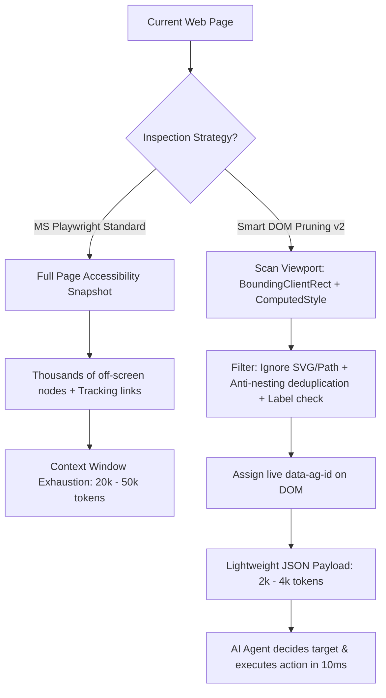

# Playwright Smart Viewport DOM Pruner (v2.0)

[](https://opensource.org/licenses/MIT)
[](https://playwright.dev/)

> **Token-Optimized Interactive Element Extraction for Browser AI Agents.**  
> Cuts LLM context consumption by up to **86.5%** and slashes action latency from **seconds down to milliseconds** compared to standard full-page accessibility snapshots.

---

## 1. Deep Comparison: Smart DOM Pruning vs Standard MS Playwright

| Criteria | Microsoft Playwright Standard (`browser_snapshot` / AXTree) | Smart Viewport DOM Pruning (v2.0) |
| :--- | :--- | :--- |
| **Extraction Scope** | Full semantic Accessibility Tree across the **entire page** | **Viewport-bounded** DOM extraction of currently visible, interactive elements only |
| **Data Scope** | Captures deep off-screen nodes, footers, hidden modals, ad iframes | **Only active elements within the user's immediate viewport** |
| **Token Consumption** | **Extremely heavy** (often 15,000 to 30,000+ tokens on SPAs & news portals) | **Ultra-compact** (typically 2,000 to 5,000 tokens, **70% - 90% reduction**) |
| **Noise & Artifacts** | Retains tracking URLs (e.g. DoubleClick), empty labels, decorative SVGs | **Filters out SVG paths, pseudo-pointers, and deduplicates nested children** |
| **Target Referencing** | Internal snapshot references (e.g. `ref="f8e30"`) | Direct live DOM attributes (`data-ag-id="3"`) |
| **Action Latency** | **1,000 ms – 7,000 ms** (locator resolution, role synchronization, key event emulation) | **9 ms – 20 ms** (direct native JavaScript execution via `browser_evaluate`) |

---

## 2. Empirical Benchmark Results

Measured under identical network conditions using **Fresh Navigation** runs on live production websites:

| Website & Scenario | Standard MS Playwright Snapshot | Smart DOM Pruning v2.0 | Improvement |
| :--- | :--- | :--- | :--- |
| **YouTube (SPA)**<br>Search query & select video | **56.5 KB** (~14,131 tokens)<br>Action latency: **7,000 ms** | **14.2 KB** (~3,550 tokens)<br>Action latency: **17.8 ms** | **74.8% token savings**<br>**390x faster** action execution |
| **VnExpress (Long News Portal)**<br>Locate & open top featured article | **84.8 KB** (~21,223 tokens)<br>Contained massive DoubleClick ad URLs | **11.4 KB** (~2,867 tokens)<br>Only viewport headline items | **86.5% token savings**<br>Zero advertising URL noise |
| **GitHub Search (Web App)**<br>Search repository & click item | **35.1 KB** (~8,795 tokens)<br>Action latency: **1,100 ms** | **18.5 KB** (~4,625 tokens)<br>Action latency: **9.6 ms** | **47.3% token savings**<br>Instantaneous **9.6 ms** click |

---

## 3. Architecture & Flow



---

## 4. Core Pruning Algorithm

This pure JavaScript function can be injected into any browser session via `page.evaluate()` or Playwright MCP's `browser_evaluate`:

```javascript
export function pruneViewportDOM() {
  const isVisible = (el) => {
    const s = window.getComputedStyle(el);
    if (s.display === 'none' || s.visibility === 'hidden' || s.opacity === '0') return false;
    const r = el.getBoundingClientRect();
    return r.width > 0 && r.height > 0 && r.top < window.innerHeight && r.bottom > 0 && r.left < window.innerWidth && r.right > 0;
  };

  const isInteractive = (el) => {
    const tag = el.tagName.toLowerCase();
    // 1. Skip decorative graphic elements
    if (['svg', 'path', 'g', 'use', 'circle', 'rect', 'polygon'].includes(tag)) return false;

    // 2. Form controls are always interactive
    if (['input', 'select', 'textarea'].includes(tag)) return true;

    // 3. Check interactive tags, ARIA roles, or pointer cursor
    const isClickable = ['button', 'a'].includes(tag) ||
      ['button', 'link', 'checkbox', 'menuitem', 'tab', 'option', 'radio', 'switch', 'combobox'].includes(el.getAttribute('role')) ||
      el.onclick != null || el.getAttribute('onclick') != null ||
      window.getComputedStyle(el).cursor === 'pointer';

    if (!isClickable) return false;

    // 4. Anti-nesting: Avoid child duplication if parent is already an interactive button/link
    const interactiveParent = el.parentElement ? el.parentElement.closest('button, a, [role="button"], [role="link"]') : null;
    if (interactiveParent && isVisible(interactiveParent)) return false;

    // 5. Must have meaningful semantic label or input role
    const text = (el.innerText || el.value || el.placeholder || el.getAttribute('aria-label') || el.getAttribute('title') || '').trim();
    return text.length > 0 || ['button', 'a', 'input'].includes(tag);
  };

  let id = 0;
  const items = [];
  document.querySelectorAll('*').forEach(el => {
    if (isVisible(el) && isInteractive(el)) {
      id++;
      el.setAttribute('data-ag-id', id.toString());
      const text = (el.innerText || el.value || el.placeholder || el.getAttribute('aria-label') || el.getAttribute('title') || '').trim().replace(/\s+/g, ' ').slice(0, 60);
      items.push({ id, tag: el.tagName.toLowerCase(), type: el.getAttribute('type') || undefined, text });
    }
  });

  return items;
}
```

---

## 5. Direct Interaction via `data-ag-id`

Once elements are pruned, they are marked directly on the live DOM with `data-ag-id`. The AI Agent can perform zero-latency actions:

### Click:
```javascript
document.querySelector('[data-ag-id="3"]')?.click();
```

### Fill / Type:
```javascript
const el = document.querySelector('[data-ag-id="1"]');
if (el) {
  el.focus();
  el.value = 'search query';
  el.dispatchEvent(new Event('input', { bubbles: true }));
  el.dispatchEvent(new Event('change', { bubbles: true }));
}
```

---

## 6. Project Structure

```
playwright-smart-pruning/
├── README.md                          # Documentation and benchmarks
├── package.json                       # NPM package metadata
├── .gitignore                         # Git ignore rules
├── src/
│   ├── pruner.js                      # Core DOM pruning function
│   └── interact.js                    # Direct DOM action helpers
└── examples/
    └── benchmark_results.json         # Raw benchmark data
```

---

## 7. License

MIT License. Designed for Antigravity & AI Browser Agents.
